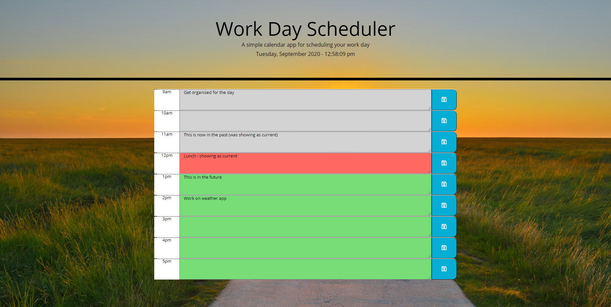
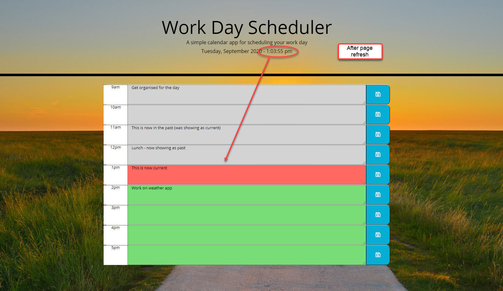

# 05 Third-Party APIs: Work Day Scheduler

This is a simple calendar application that allows the user to save events for each hour of the day. 
This app runs in the browser and features dynamically updated HTML and CSS powered by jQuery.

# Working App: https://mulys001.github.io/Day-Planner/

## User Story

```
AS AN employee with a busy schedule
I WANT to add important events to a daily planner
SO THAT I can manage my time effectively
```

## Acceptance Criteria

```
GIVEN I am using a daily planner to create a schedule
WHEN I open the planner
THEN the current day is displayed at the top of the calendar
WHEN I scroll down
THEN I am presented with timeblocks for standard business hours
WHEN I view the timeblocks for that day
THEN each timeblock is color coded to indicate whether it is in the past, present, or future
WHEN I click into a timeblock
THEN I can enter an event
WHEN I click the save button for that timeblock
THEN the text for that event is saved in local storage
WHEN I refresh the page
THEN the saved events persist
```

## My App
My app was developed with html, styled with css & bootstrap.  The core functionality dynamincally updates via Jquery functionality.  Saved entries are stored in local storage and persist on the page after refresh.  The timer at the top of the page shows current time with seconds counter.  

#### App - Screen shot 1



#### App - Screen shot 2


